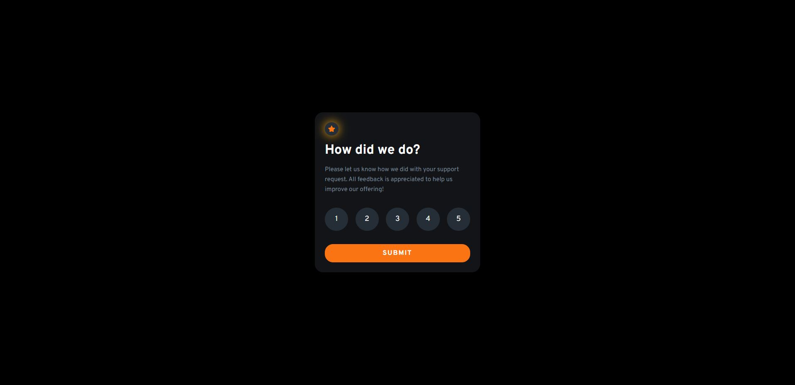

# Frontend Mentor - Interactive rating component solution

This is a solution to the [Interactive rating component challenge on Frontend Mentor](https://www.frontendmentor.io/challenges/interactive-rating-component-koxpeBUmI). Frontend Mentor challenges help you improve your coding skills by building realistic projects. 

## Table of contents

- [Overview](#overview)
  - [The challenge](#the-challenge)
  - [Screenshot](#screenshot)
  - [Links](#links)
- [My process](#my-process)
  - [Built with](#built-with)
  - [What I learned](#what-i-learned)
  - [Continued development](#continued-development)
- [Author](#author)
- [Acknowledgments](#acknowledgments)

## Overview

### The challenge

Users should be able to:

- View the optimal layout for the app depending on their device's screen size
- See hover states for all interactive elements on the page
- Select and submit a number rating
- See the "Thank you" card state after submitting a rating

### Screenshot

### Links

- Solution URL: [https://github.com/aljager1983/interactive-rating-component]
- Live Site URL: [https://aljager1983.github.io/interactive-rating-component/]

## My process

### Built with

- Semantic HTML5 markup
- Flexbox
- CSS Grid
- Mobile-first workflow

### What I learned

  1. Adding select and de-select functionality
  2. Using box-shadow and text-shadow
  3. Clearing the console in browser
  4. Recalling javascript semantics

### Continued development

Going to keep on doing more challenges in frontend mentor.

## Author

- Frontend Mentor - [@aldrinbfernandez](https://www.frontendmentor.io/profile/aldrinbfernandez)
- Twitter - [@promdiGamer](https://twitter.com/promdiGamer)

## Acknowledgments

The courses I have undergone in Udemy with Dr. Angela is helping me a lot. Had couple of notes during that bootcamp and I'm now they are helping a lot since I can't remember most of the syntaxes.

Additionally, I got some solution in stackoverflow (cant remember the thread though) for the deselect funcitonality.

